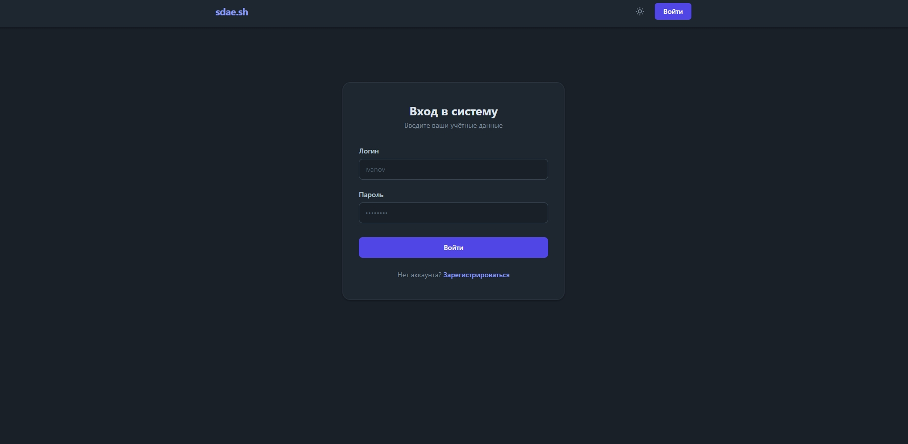
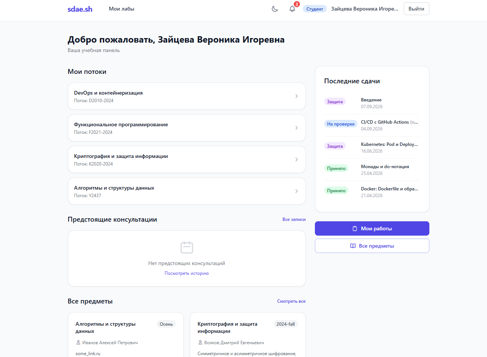
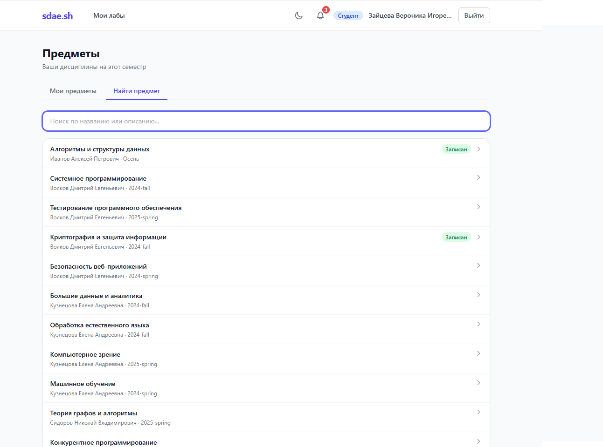
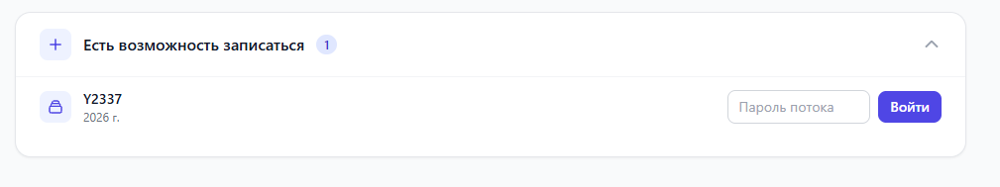
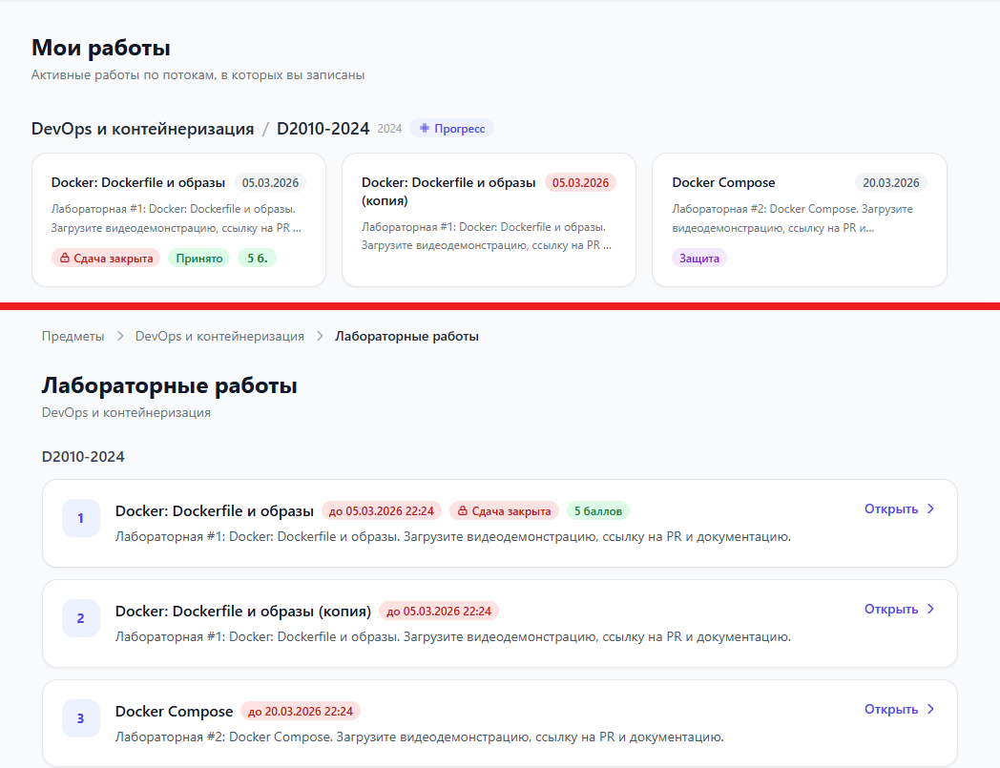
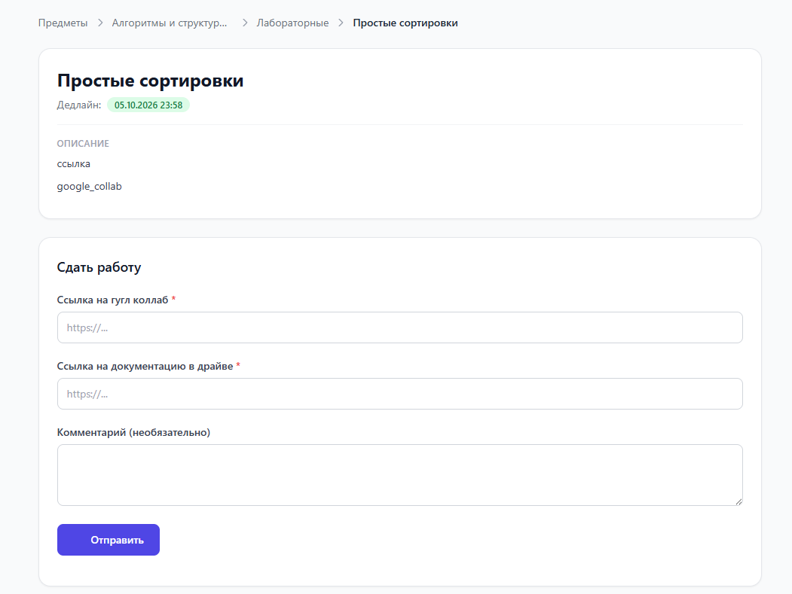
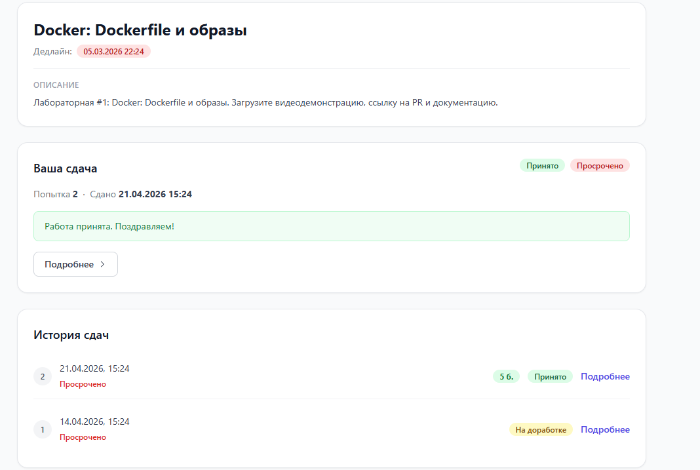
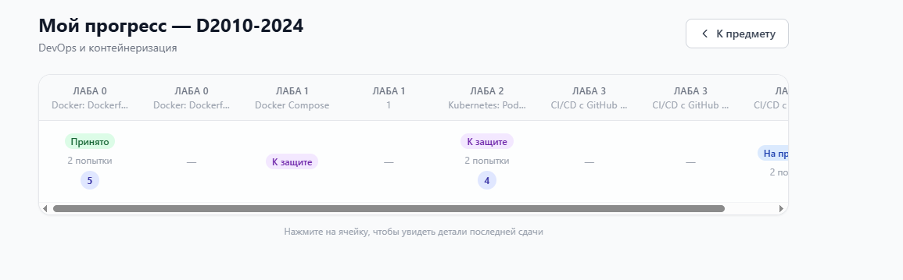
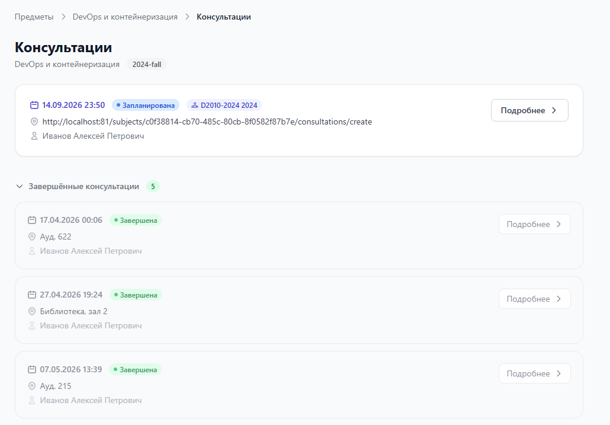
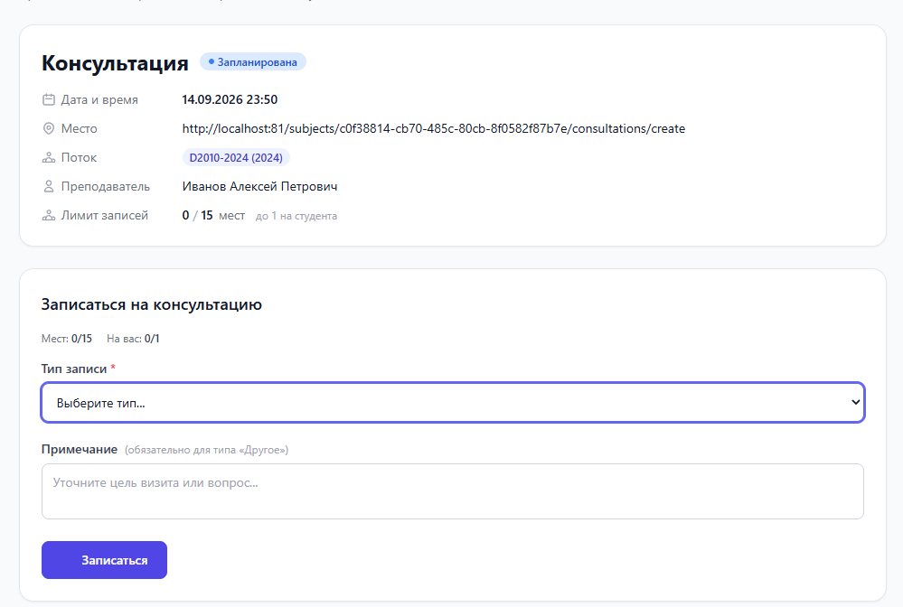

# Гайд для студента — sdae.sh

Система приёма лабораторных работ.

---

## Оглавление

1. [Как всё устроено — коротко](#1-как-всё-устроено--коротко)
2. [Основные понятия](#2-основные-понятия)
3. [Регистрация и вход](#3-регистрация-и-вход)
4. [Главная страница](#4-главная-страница)
5. [Как найти предмет и записаться на поток](#5-как-найти-предмет-и-записаться-на-поток)
6. [Лабораторные работы: список и дедлайны](#6-лабораторные-работы-список-и-дедлайны)
7. [Как сдать лабораторную работу](#7-как-сдать-лабораторную-работу)
8. [Статусы вашей работы](#8-статусы-вашей-работы)
9. [Пересдача (доработка)](#9-пересдача-доработка)
10. [Ваш журнал (прогресс по потоку)](#10-ваш-журнал-прогресс-по-потоку)
11. [Консультации: запись и защита](#11-консультации-запись-и-защита)
12. [Уведомления](#12-уведомления)
13. [Тёмная тема](#13-тёмная-тема)
14. [Частые вопросы](#14-частые-вопросы)
15. [Приложение. Короткий чек-лист](#приложение-короткий-чек-лист)

---

## 1. Как всё устроено — коротко

1. Записываетесь на **поток** внутри нужного предмета.
2. Открываете **лабораторную работу** и отправляете её через форму.
3. Следите за **статусом**: приняли, отправили на доработку, пригласили на защиту.
4. При необходимости записываетесь на **консультацию** (в том числе на защиту работы).
5. Итоговый статус и **баллы** ставит преподаватель.

---

## 2. Основные понятия

| Понятие | Что это |
|---|---|
| **Предмет** | Дисциплина. Внутри — потоки, лабораторные работы, консультации. |
| **Поток** | Группа студентов внутри предмета. Чтобы видеть лабораторные работы и сдавать их, нужно записаться в поток. |
| **Лабораторная работа** | Задание. У неё есть описание, обычно дедлайн, иногда лимит попыток и набор полей, которые вы заполняете при сдаче. |
| **Сдача (попытка)** | Одна отправка работы. Каждая новая попытка — отдельная запись, прошлые попытки сохраняются. |
| **Статус** | Состояние вашей работы: на проверке / на доработке / приглашён на защиту / принято / отклонено. |
| **Оценка (баллы)** | Числовой балл. Ставится преподавателем **отдельно** от статуса. |
| **Консультация** | Слот с датой и местом, на который вы записываетесь (вопрос преподавателю или защита работы). |
| **Журнал** | Ваша таблица прогресса по потоку: статусы и оценки по всем работам. |

---

## 3. Регистрация и вход

1. Откройте страницу регистрации (`/auth/register`).
2. Заполните:
   - **Логин** — по нему вы входите (обязательно, уникальный).
   - **Полное имя** (обязательно).
   - **Электронная почта** (необязательно).
   - **Пароль** и его повтор.
3. Войдите по логину и паролю (`/auth/login`).

Сессия хранится в браузере ~24 часа, потом нужен повторный вход. Кнопка **«Выйти»** — справа вверху.

> ℹ️ Входа через университетскую учётную запись и восстановления пароля через интерфейс пока нет.

---

## 4. Главная страница

После входа вы видите свою учебную панель:

- **Мои потоки** — потоки, в которые вы записаны. Клик по потоку → страница предмета.
- **Предстоящие консультации** — ближайшие ваши записи. Ссылка **«Все записи»** → полная история.
- **Все предметы** — карточки предметов. Ссылка **«Смотреть все»** → полный список с поиском.
- **Последние сдачи** (сбоку) — ваши недавние отправки со статусами.
- Быстрые ссылки: **«Мои работы»** и **«Все предметы»**.

Верхнее меню: **«Мои лабы»** открывает страницу **«Мои работы»** — активные работы по всем вашим потокам сразу.

Справа вверху: **колокольчик уведомлений** и **переключатель темы** (луна/солнце).

---

## 5. Как найти предмет и записаться на поток

### 5.1 Обычный путь

Как правило, преподаватель присылает вам **ссылку на предмет**. Откройте её и переходите к записи на поток (шаг 5.3).

### 5.2 Если ссылки нет

1. Откройте **«Все предметы»** (в меню, на главной или по адресу `/subjects/`).
2. Перейдите на вкладку **«Найти предмет»**.
3. Введите название или часть описания в поиск и выберите нужный предмет.

### 5.3 Запись на поток

На странице предмета есть раздел **«Есть возможность записаться»**:

- В нём показаны только **активные потоки с паролем**, на которые вы ещё не записаны.
- Нажмите **«Записаться»** → появится поле для пароля → введите пароль (его даёт преподаватель) → **«Войти»**.
- При успехе кнопка сменится на **«Вы записаны»**.

Если нужного потока в этом разделе нет:

- **У потока нет пароля** — такие потоки здесь не показываются, на них вас записывает преподаватель сам.
- **Поток неактивен (скрыт)** — он ещё не открыт или уже завершён.
- Если пароль есть, но записаться не получается — преподаватель тоже может добавить вас вручную.

### 5.4 После записи

- Поток появляется в разделе **«Я записан»** (с кнопкой **«Журнал»**) и на главной в **«Мои потоки»**.
- На странице предмета становятся доступны карточки **«Лабораторные работы»** и **«Консультации»**.
- Если поток позже станет неактивным, он переедет в раздел **«Неактивные потоки»** — работы можно будет только просматривать.

---

## 6. Лабораторные работы: список и дедлайны

Где смотреть работы:

- **«Мои работы»** (меню «Мои лабы» или быстрая ссылка) — активные работы по **всем** вашим потокам, сгруппированные по потоку. На карточке видны дедлайн, метка **«Сдача закрыта»**, статус последней сдачи и баллы. Ссылка **«Прогресс»** у каждого потока ведёт в журнал.
- **Страница предмета → «Лабораторные работы»** — список по потокам, только активные работы. У каждой: номер, название, дедлайн (**«до …»** или **«Без срока»**), метка «Сдача закрыта», баллы, краткое описание и кнопка **«Открыть»**.

Про дедлайн:

- Плашка дедлайна подсвечивается: **зелёная** — срок ещё не прошёл, **красная** — уже прошёл.
- Сдать после дедлайна можно, пока приём открыт, но сдача будет помечена **«Просрочено»**. 
- Изменение дедлайна **не** меняет метку «Просрочено» у уже отправленных работ.

---

## 7. Как сдать лабораторную работу

1. Откройте работу и прочитайте **описание и требования** в шапке.
2. Заполните поля формы сдачи. Их набор задаёт преподаватель для каждой работы:
   - обычно это ссылки — на видео с демонстрацией реализацтт, на документ/отчёт
   - В других случаях — свой набор полей (например, ссылка на Google Colab и комментарий). Обязательные поля помечены звёздочкой `*`, тип поля — ссылка, короткий текст или многострочный текст.
3. Нажмите **«Отправить»**. Появится сообщение **«Работа успешно отправлена на проверку!»**, статус станет **«На проверке»**, преподавателю придёт уведомление.

Дальше:

- Внизу страницы работы есть блок **«История сдач»** — все ваши попытки со статусами, датами и оценками. Кнопка **«Подробнее»** открывает конкретную сдачу: отправленные материалы, оценку (если есть) и комментарии преподавателя.
- Пока идёт проверка, **работу повторно отправить нельзя** — форма откроется снова только если работу вернут на доработку (см. [раздел 9](#9-пересдача-доработка)).
- Форма сдачи **не откроется**, если: поток завершён; преподаватель закрыл приём (**«Сдача закрыта»**); исчерпан лимит попыток. В этих случаях будет короткое пояснение вместо формы.

---

## 8. Статусы вашей работы

| Статус | Что значит | Что делать |
|---|---|---|
| **На проверке** | Отправлено, преподаватель ещё не смотрел |Можете записаться на консультацию с работой или ждать когда работу посмотрят и приглашат на защиту (зависит от предмета) |
| **На доработке** | Нужны правки | Прочитать комментарии, исправить, отправить снова |
| **Приглашён на защиту** (в журнале — «К защите») | Преподаватель зовёт на защиту | Записаться на консультацию типа «Сдача работы» |
| **Принято** | Работа зачтена | Ничего, работа сдана |
| **Отклонено** | Работа не принята | Связаться с преподавателем |

- Пояснение к статусу и **комментарии преподавателя** видны на странице сдачи (**«Подробнее»** из истории).
- **Оценка (баллы)** ставится отдельно от статуса и может появиться даже пока работа «На проверке» или «К защите». В журнале показывается последняя оценка за последнюю попытку.
- Изменение статуса и новая оценка приходят вам в **уведомлениях**.

---

## 9. Пересдача (доработка)

- Отправить новую попытку можно, **только если последняя попытка в статусе «На доработке»**. Статусы «Принято» и «Отклонено» повторную сдачу не открывают.
- Когда работу вернули на доработку, на её странице снова появляется форма (**«Сдать повторно»**) с напоминанием исправить замечания. Прошлые попытки остаются в **«Истории сдач»**.
- Если преподаватель **закрыл приём работ**, пересдать не получится даже со статусом «На доработке» — напишите преподавателю.

---

## 10. Ваш журнал (прогресс по потоку)

Откройте журнал кнопкой **«Журнал»** (страница предмета, раздел «Я записан») или **«Прогресс»** (в «Мои работы» и на странице предмета). Заголовок — **«Мой прогресс — {поток}»**.

- Это одна строка: колонки — лабораторные работы, в каждой ячейке — статус, число попыток (если их больше одной) и оценка.
- **Клик по ячейке** раскрывает детали последней сдачи по этой работе и ссылку **«Подробнее»**.
- Если поток завершён, сверху появляется пометка — доступен только просмотр истории.

---

## 11. Консультации: запись и защита

### 11.1 Где смотреть

- **Страница предмета → «Консультации»** — консультации для всех потоков и лично для вашего потока. Завершённые собраны в сворачиваемом разделе.
- **«Мои консультации»** (ссылка «Все записи» на главной) — все ваши записи: **предстоящие** и **прошедшие**.

### 11.2 Как записаться

Откройте нужную консультацию → блок **«Записаться на консультацию»**:

1. **Тип записи**:
   - **Сдача работы** — доступно, если вы приглашены на защиту **или** уже отправили работу со ссылками на pull request и документ. То есть на защиту можно записаться заранее, не дожидаясь приглашения.
   - **Другое** — любой вопрос преподавателю. Нужно заполнить **«Примечание»**.
2. Для типа «Сдача работы» можно **прикрепить конкретную работу** из списка ваших сдач.
3. **«Примечание»** — свободный текст (что хотите обсудить). Для типа «Другое» — обязательно.
4. Нажмите **«Записаться»**.

### 11.3 После записи

- У записи появляются **статус**, **дата записи** и **место в очереди**.
- **Заметку можно изменить позже** — например, если готовы пропустить кого-то вперёд, напишите об этом в заметке.
- Если преподаватель не ограничил лимит, можно сделать **несколько записей** на одну консультацию.
- **Отмена**: на карточке записи — **«Отменить запись»** → при желании укажите причину → **«Подтвердить отмену»**.

### 11.4 Очередь и проведение

- На странице консультации есть таблица **«Очередь»** — все записавшиеся, ваша строка выделена. Только для просмотра.
- Формат объявляет преподаватель: ссылка на созвон (Толк и т. п.) или очно.
- Вы приходите на защиту; **статус лабораторной работы меняет преподаватель** со своей стороны.
- Статус вашей записи на консультацию (**«Принят»**, **«Не пришёл»** и т. п.) — это только про явку. Он **не равен** статусу работы и не является оценкой.

### 11.5 Ограничения

- **«Все места заняты — X/Y записей»** или **«Вы уже записались N раз — лимит M на студента»** — записаться нельзя.
- Консультация **закрывается для записи** примерно через сутки после времени начала.

---

## 12. Уведомления

Колокольчик справа вверху обновляется примерно раз в 30 секунд. Полный список — на странице **«Уведомления»** (`/notifications/`).

Вам приходят уведомления, когда преподаватель:

- изменил статус вашей работы;
- выставил оценку;
- изменил статус вашей записи на консультацию.

Клик по уведомлению открывает нужный экран; **«Прочитано»** убирает его из списка.

---

## 13. Тёмная тема

Иконка луны/солнца справа вверху переключает светлую и тёмную темы. Выбор запоминается в браузере. По умолчанию тема следует настройке вашей операционной системы.

---

## 14. Частые вопросы

**Не вижу нужный предмет.** Попросите у преподавателя ссылку или найдите предмет через «Все предметы» → «Найти предмет».

**Не могу записаться на поток.** У потока может не быть пароля — тогда вас записывает преподаватель. Либо поток пока неактивен. Напишите преподавателю.

**Не открывается форма сдачи.** Возможные причины: поток завершён; преподаватель закрыл приём («Сдача закрыта»); исчерпан лимит попыток; предыдущая попытка ещё не возвращена на доработку (сдать поверх статусов «На проверке», «Принято», «Отклонено» нельзя).

**Сдаю после дедлайна.** Это возможно, пока приём открыт, но сдача будет помечена «Просрочено»

**Дедлайн изменили — пересчитается ли «Просрочено»?** Нет, метка ставится в момент отправки.

**Не могу выбрать тип записи «Сдача работы».** Нужно приглашение на защиту или уже отправленная работа с заполненными полями

**Нет оценки.** Преподаватель ещё не выставил баллы либо работа не сдана. Баллы придут в уведомлениях.

**Где посмотреть работы по всем предметам сразу.** Страница «Мои работы» (меню «Мои лабы»).

**Роль и пароль.** Роль выбирается при регистрации. Восстановления пароля через интерфейс пока нет — обратитесь к преподавателю или администратору.

---

## Приложение. Короткий чек-лист

1. Зарегистрируйтесь и войдите.
2. Откройте предмет — по ссылке от преподавателя или через «Все предметы» → «Найти предмет».
3. Запишитесь на поток по паролю или дождитесь, пока запишет преподаватель.
4. Откройте «Лабораторные работы», выберите нужную, прочитайте описание.
5. Заполните поля формы и нажмите «Отправить».
6. Следите за статусом и комментариями. При статусе «На доработке» — исправьте и отправьте снова.
7. Когда пригласят на защиту (или сразу после отправки работы) — запишитесь на консультацию с типом «Сдача работы».
8. Приходите на консультацию в объявленном преподавателем формате. Итоговый статус и баллы поставит преподаватель.
9. Прогресс и оценки смотрите в «Журнале» потока.

---

*Документ описывает текущую версию сервиса. Отдельные формулировки в интерфейсе могут отличаться.*
