# Гайд для преподавателя — sdae.sh

Система приёма и проверки лабораторных работ.

---

## Как пользоваться этим документом

Места для **скриншотов** помечены так: ``. Замените путь на свой файл (например, сложите картинки в `docs/screens/`).

---

## Оглавление

1. [Основные понятия](#1-основные-понятия)
2. [Роли и доступ](#2-роли-и-доступ)
3. [Регистрация и вход](#3-регистрация-и-вход)
4. [Главная страница преподавателя](#4-главная-страница-преподавателя)
5. [Предмет](#5-предмет)
6. [Потоки](#6-потоки)
7. [Лабораторные работы](#7-лабораторные-работы)
8. [Поля для сдачи (схема формы)](#8-поля-для-сдачи-схема-формы)
9. [Запись студентов](#9-запись-студентов)
10. [Приём и проверка работ](#10-приём-и-проверка-работ)
11. [Консультации](#11-консультации)
12. [Аналитика: сводная таблица и экспорт](#12-аналитика-сводная-таблица-и-экспорт)
13. [Уведомления](#13-уведомления)
14. [Тёмная тема](#14-тёмная-тема)
15. [Частые вопросы и известные ограничения](#15-частые-вопросы-и-известные-ограничения)
16. [Приложение. Полный сценарий «с нуля» за 10 шагов](#приложение-полный-сценарий-с-нуля-за-10-шагов)

---

## 1. Основные понятия

| Понятие | Что это |
|---|---|
| **Предмет** | Дисциплина. Создаёт преподаватель. Один предмет — одно «хранилище» на все семестры и потоки. Внутри предмета: потоки, лабораторные работы, консультации. |
| **Ассистент (соредактор)** | Другой преподаватель, которому вы дали полные права на редактирование предмета (потоки, лабораторные работы, студенты, консультации). Не может только назначать других ассистентов. |
| **Поток** | Группа студентов внутри предмета. Вы сами решаете, как делить: по направлениям, по практикам, по годам набора — или вообще не делить и вести один общий поток. **Все лабораторные работы привязаны к потоку.** |
| **Лабораторная работа** | Задание внутри потока. У лабораторной работы есть название, описание, порядковый номер, необязательный дедлайн, необязательный лимит попыток и настраиваемый набор полей, которые заполняет студент при сдаче. |
| **Сдача (сабмит)** | Одна попытка студента сдать лабораторную работу. Неизменяема: каждая новая попытка — отдельная запись, вся история сохраняется. |
| **Статус сдачи** | Состояние работы: на проверке / на доработке / приглашён на защиту / принято / отклонено. |
| **Оценка (баллы)** | Числовой балл за сдачу. Выставляется **отдельно** от статуса. Шкалу выбираете вы (например, 3 балла, 12 баллов). |
| **Консультация** | Слот с датой, местом и лимитами, на который записываются студенты (например, для защиты лабораторной работы). |
| **Сводная таблица** | Журнал потока: матрица «студенты × лабораторные работы» со статусами и оценками. |

---

## 2. Роли и доступ

Три роли: **студент**, **преподаватель**, **администратор**.

- Роль назначается один раз и не меняется через интерфейс.
- Преподаватель и администратор работают в одном интерфейсе; администратор дополнительно видит все предметы.
- Студент — отдельный интерфейс, преподавательские страницы ему недоступны.

Что может преподаватель:

- Создавать и редактировать **свои** предметы (и предметы, где он добавлен ассистентом).
- Создавать потоки, лабораторные работы, консультации.
- Записывать студентов в поток вручную.
- Менять статусы сдач, выставлять оценки, писать комментарии.
- Смотреть сводную таблицу и выгружать CSV.

Чего преподаватель **не может**: сдавать лабораторные работы и записываться на консультации (это только для студентов).

---

## 3. Регистрация и вход

1. Откройте страницу регистрации (`/auth/register`).
2. Заполните:
   - **Логин** — по нему вы входите в систему (обязательно, уникальный).
   - **Полное имя** (обязательно).
   - **Электронная почта** (необязательно).
   - **Пароль** и его повтор.
3. После регистрации войдите по логину и паролю (`/auth/login`).
4. Права преподавателя выдаёт администратор. До этого вы будете видеть студенческий интерфейс.

Сессия хранится в cookie и действует ~24 часа, затем нужен повторный вход. Кнопка **«Выйти»** — справа вверху.

> ℹ️ Входа через университетскую учётную запись пока нет — планируется. Восстановления пароля через интерфейс тоже пока нет.

---

## 4. Главная страница преподавателя

После входа открывается ваша панель:

- **Мои предметы** — карточки всех ваших предметов и предметов, где вы ассистент. Кнопка **«Создать предмет»**.
- **Ожидают проверки** — счётчик всех работ со статусом «на проверке» по всем вашим предметам. Клик по карточке → общая очередь проверки.
- **Колокольчик уведомлений** (справа вверху) — новые сдачи, изменения статусов и т. д. Обновляется автоматически примерно раз в 30 секунд.
- **Переключатель темы** (иконка луны/солнца) — светлая / тёмная.

Верхнее меню: **«Панель»** и **«Предметы»** ведут на эту же главную страницу.

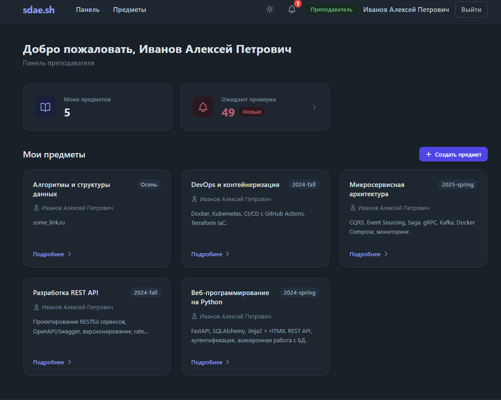

---

## 5. Предмет

### 5.1 Создание предмета

На главной нажмите **«Создать предмет»** и заполните форму:

| Поле | Обязательное | Комментарий |
|---|---|---|
| **Название** | да | Например, «Веб-программирование». |
| **Семестр** | да | Формат «год-сезон», например `2025-fall`. Поле считается устаревшим и, возможно, будет убрано — одно хранилище рассчитано на все семестры. Пишите что угодно осмысленное. |
| **Описание** | нет | Можно вставить ссылку на общую документацию, Google Диск с материалами и т. п. |

После создания открывается страница предмета.

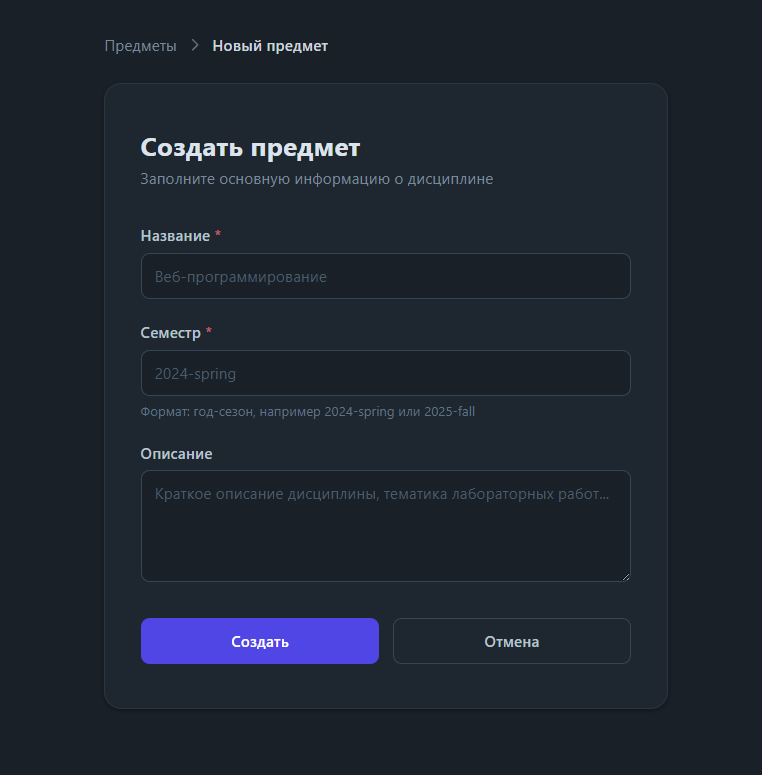

### 5.2 Редактирование предмета

Кнопка **«Редактировать»** на странице предмета. Меняются название, семестр и описание.

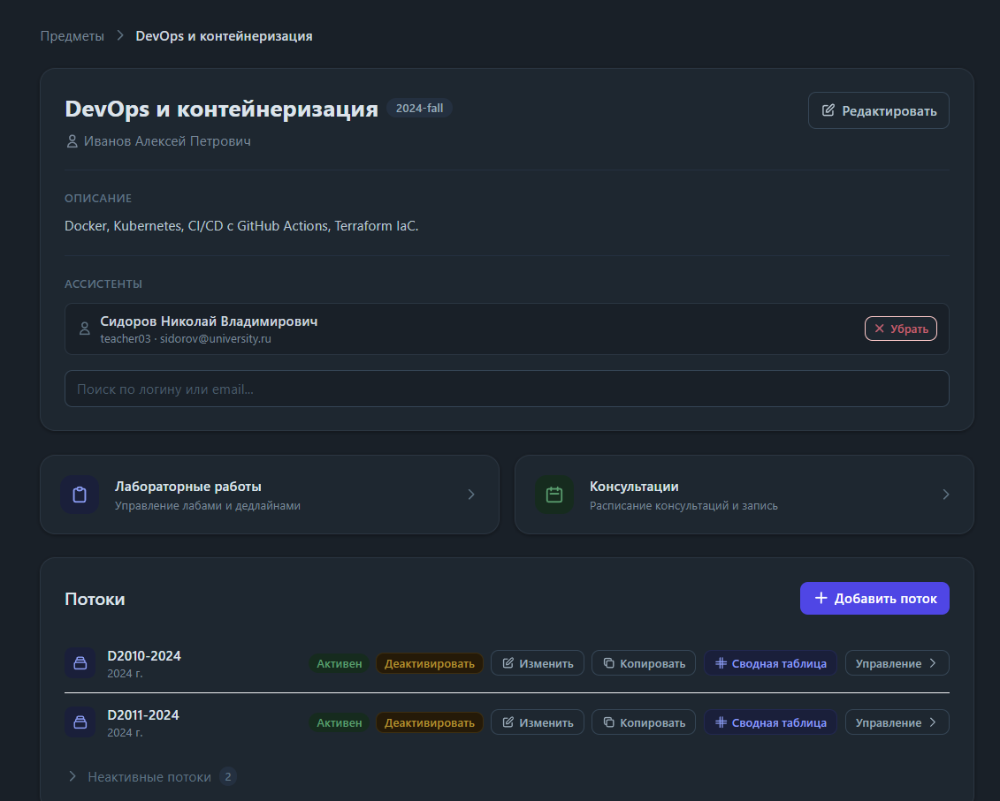

### 5.3 Ассистенты (соредакторы)

В блоке **«Ассистенты»** на странице предмета (виден только владельцу и администратору):

1. Начните вводить логин или email преподавателя в поле поиска.
2. Выберите его из выпадающего списка — он сразу добавляется.
3. Убрать ассистента — кнопкой **«Убрать»** рядом с ним.

Ассистент получает **те же права на предмет**, что и вы: правит предмет, добавляет потоки, лабораторные работы, студентов, консультации. Единственное ограничение — назначать и снимать ассистентов может только владелец предмета.

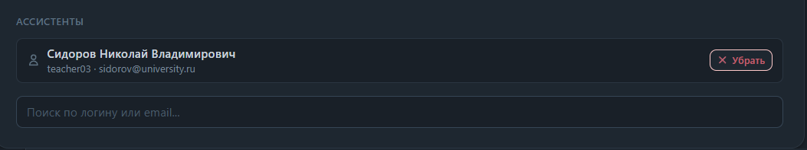

---

## 6. Потоки

### 6.1 Зачем нужны потоки

Поток — это способ организовать работу со студентами так, как удобно именно вам:

- студенты с разных направлений → **разные потоки** с разным набором лабораторных работ;
- несколько практиков ведут один предмет → **у каждого свой поток**, чтобы не пересекаться;
- всех ведёте сами → **один общий поток**.

Всё содержимое (лабораторные работы) живёт внутри потока, поэтому первым делом после создания предмета заводят поток.

### 6.2 Создание потока

На странице предмета нажмите **«Добавить поток»**:

| Поле | Обязательное | Комментарий |
|---|---|---|
| **Название потока** | да | Ограничений нет: код группы (`K3140-2024`), название с направлением, что угодно. |
| **Год набора** | да | Число. |
| **Пароль для записи** | нет | См. ниже. |

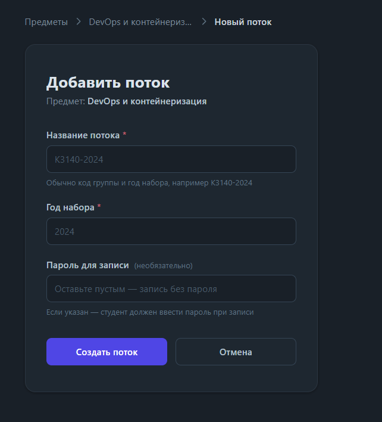

### 6.3 Пароль для записи

- **Пароль задан** → студент записывается сам: открывает страницу предмета, выбирает поток, вводит пароль. Вам достаточно дать студентам ссылку на предмет и сказать пароль (или разные пароли для разных потоков).
- **Пароль пустой** → студентов записываете вы вручную (см. [раздел 9](#9-запись-студентов)).

Рекомендация: пока нет входа через университетскую учётную запись — **всегда задавайте пароль**, чтобы студенты записывались сами (например, `2026-2027`).

### 6.4 Активные и неактивные потоки

У каждого потока есть переключатель **«Активен / Неактивен»** (кнопки «Деактивировать» / «Активировать»).

- **Неактивный поток скрыт от студентов** — они не могут в него зайти и сдавать. У студентов такие потоки собраны в раздел «Неактивные потоки» в режиме «только чтение».
- У преподавателя неактивные потоки свёрнуты в отдельный список внизу.
- **Удалять потоки нельзя.** Если поток больше не нужен — деактивируйте его.

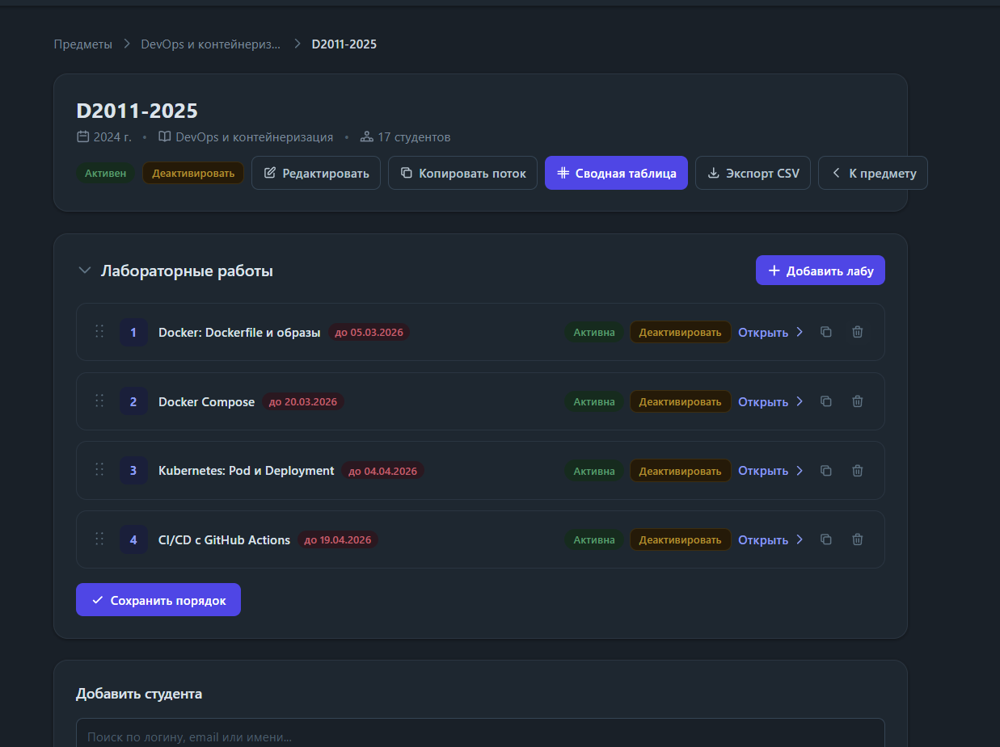

### 6.5 Рекомендованный сценарий: поток-шаблон + копирование

Так как потоки не удаляются, а лабораторные работы удобно настраивать один раз:

1. Заведите **потоковый шаблон** (тестовый «мок-поток», без пароля).
2. Наполните его всеми лабораторными работами и настройте у каждой поля для сдачи.
3. **Деактивируйте** его, чтобы не мешался.
4. Для каждой реальной группы **копируйте** этот поток.

При копировании переносится **весь состав лабораторных работ** (вместе с описаниями, дедлайнами, лимитами попыток и схемами полей). **Студенты и сданные работы не переносятся.**

### 6.6 Копирование потока

Кнопка **«Копировать поток»** на странице потока (или «Копировать» в списке потоков на странице предмета):

| Поле | Комментарий |
|---|---|
| **Название потока** | Название новой копии. |
| **Год** | По умолчанию подставляется «год источника + 1». |
| **Пароль для записи** | Можно задать новый или оставить пустым. |

После копирования вы попадаете на страницу нового потока. Флаг активности каждой лабораторной работы сохраняется как в источнике; приём работ у скопированных лабораторных работ всегда открыт.

---

## 7. Лабораторные работы

### 7.1 Создание лабораторной работы

На странице потока нажмите **«Добавить лабу»** — откроется форма создания лабораторной работы:

| Поле | Обязательное | Комментарий |
|---|---|---|
| **Название** | да | Например, «Введение», «Простые сортировки». |
| **Порядковый номер** | да | Определяет порядок в списке. ⚠️ **Минимум 1.** Если поставить 0, лабораторная работа не создастся (известная особенность). Формально «нулевая» лабораторная работа заводится с номером 1. |
| **Срок сдачи** | нет | Дата и время. Если не указан — срок не ограничен. |
| **Описание** | нет | Редактор форматированного текста (жирный, списки, ссылки). Обычно сюда кладут задание и ссылку на Google Colab / Диск. |

После создания вы **автоматически попадаете на страницу редактирования** этой лабораторной работы — там же настраиваются лимит попыток и поля для сдачи.

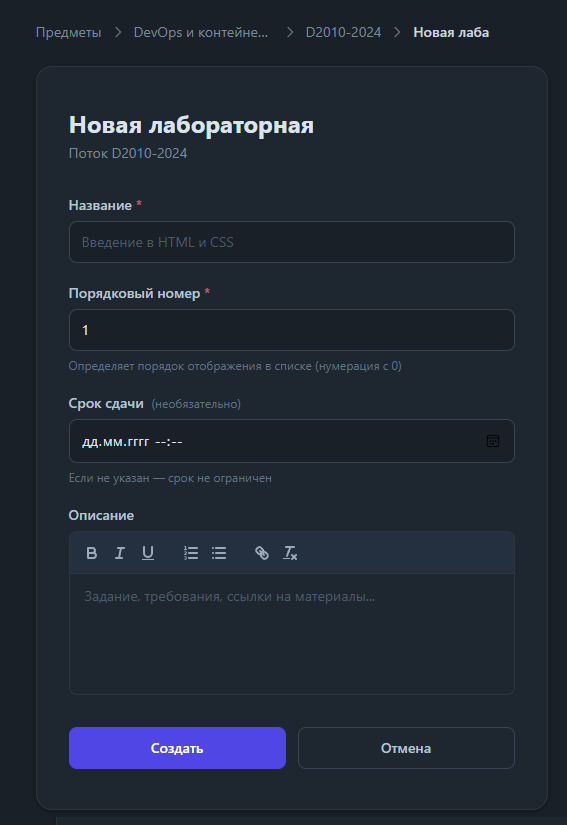

### 7.2 Редактирование лабораторной работы

Страница редактирования лабораторной работы (`/labs/<id>/edit`). Кроме названия, номера, срока и описания здесь есть:

- **Лимит попыток** — необязательно. Пусто или 0 = без ограничений. Если задать, скажем, 2 — после двух сдач студент больше не сможет отправить работу (удобно, чтобы не «докручивали» балл бесконечно).

Блок **«Поля для сдачи»** находится **в самом низу** страницы редактирования — это неочевидно, листайте вниз. Его настройка подробно описана в [разделе 8](#8-поля-для-сдачи-схема-формы).

### 7.3 Копирование лабораторной работы

Чтобы не настраивать поля заново для каждой новой лабораторной работы, скопируйте похожую:

- иконка «копировать» рядом с лабораторной работой в списке потока, **или**
- кнопка **«Копировать»** на странице лабораторной работы (появляется, если открыть её из потока кнопкой «Открыть»).

Создаётся копия с названием «… (копия)», куда переносятся описание, дедлайн, лимит попыток и **схема полей**. Сданные работы, оценки и комментарии не копируются. После копирования вы попадаете на страницу редактирования копии — поменяйте название и номер.

### 7.4 Порядок, активность и удаление лабораторной работы из потока

На странице потока в списке лабораторных работ:

- **Перетаскивание за «ручку»** меняет порядок → нажмите **«Сохранить порядок»**.
- Кнопка **«Активна / Неактивна»** у каждой лабораторной работы — скрывает её от студентов этого потока, не удаляя её.
- **Иконка корзины** — убирает лабораторную работу из потока (с подтверждением).

### 7.5 Закрытие приёма работ

На странице лабораторной работы (вид преподавателя) есть кнопка **«Закрыть сдачу» / «Открыть сдачу»**. Когда сдача закрыта, студенты видят сообщение «Сдача закрыта» и не могут отправить работу. Это независимо от лимита попыток и дедлайна.

---

## 8. Поля для сдачи (схема формы)

Каждая лабораторная работа может иметь **свой набор полей**, которые студент заполняет при сдаче.

### 8.1 Стандартная форма

Если схема полей **пустая**, используется стандартная форма:

- Ссылка на Лабораторную Работу
- Ссылка на Отчет

### 8.2 Своя схема полей

В блоке **«Поля для сдачи»** на странице редактирования лабораторной работы:

1. Нажмите **«Добавить поле»**.
2. Для каждого поля укажите:
   - **Ключ** — латиницей, без пробелов (`colab_url`, `doc_url`, `comment`). Технический идентификатор.
   - **Название поля** — то, что видит студент («Ссылка на Colab»).
   - **Тип**:
     - **URL** — поле для ссылки;
     - **Текст** — короткая однострочная строка (например, короткий комментарий);
     - **Многострочный текст** — длинный форматированный текст.
   - **Обяз.** — галочка «обязательное поле».
3. Нажмите **«Сохранить схему»** — это **отдельная кнопка** от «Сохранить» для самой лабораторной работы.

После сохранения студенты этой лабораторной работы будут заполнять именно эти поля.

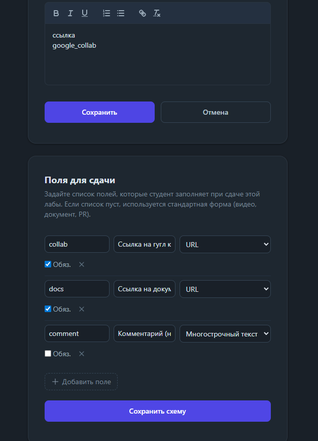

### 8.3 Важное про изменение схемы

- **Добавлять новые поля безопасно** — старые сдачи просто не будут содержать значения для них.
- **Не переименовывайте и не удаляйте поля после того, как студенты уже начали сдавать**: уже отправленные значения хранятся по старому ключу и перестанут отображаться в интерфейсе проверки.
- Схема, действовавшая на момент сдачи, по возможности «замораживается» за конкретной сдачей — но полагаться на это при массовых правках схемы не стоит.

---

## 9. Запись студентов

### 9.1 Самозапись по паролю

Если у потока задан пароль: студент открывает страницу предмета → выбирает поток → вводит пароль → записан. Вам нужно только дать ссылку на предмет и сообщить пароль.

### 9.2 Запись преподавателем вручную

На странице потока, блок **«Добавить студента»**:

1. Введите логин, email или имя в поле поиска.
2. Выберите студента из списка — он добавляется в поток.

Студент должен быть **уже зарегистрирован** в системе. Ниже — таблица записавшихся студентов (ФИО, логин, email, дата записи).

---

## 10. Приём и проверка работ

### 10.1 Как студент сдаёт работу

Студент открывает лабораторную работу, заполняет поля (стандартные или заданные вашей схемой) и отправляет. Создаётся сдача со статусом **«На проверке»**, вам приходит уведомление.

Повторно сдать студент может **только если последняя попытка в статусе «На доработке»**. Каждая новая попытка — отдельная запись с номером `2`, `3`, …

### 10.2 Статусы сдачи

Всего **пять** состояний. Из свежей сдачи вы выбираете один из **четырёх** переходов:

| Статус | Смысл |
|---|---|
| **На проверке** (`submitted`) | Студент сдал, вы ещё не смотрели. |
| **На доработке** (`revision_requested`) | Нужны правки. Студент получает уведомление и может сдать новую попытку. Пока вы ждёте студента — других переходов нет. |
| **Приглашён на защиту** (`invited_to_defense`) | Официальное приглашение на защиту. Студент может записаться на консультацию типа «Сдача работы». |
| **Принято** (`accepted`) | Работа принята. Предполагается, что защита не требуется и итоговый балл вы дальше выставляете в свою систему (БАРС и т. п.). |
| **Отклонено** (`rejected`) | Работа отклонена. |

Переходы гибкие: из «Принято», «Отклонено» и «Приглашён на защиту» можно вернуть работу в любой другой статус (например, «На доработке»), если вы ошиблись. «На доработке» — единственный статус, из которого дальше ходит только студент.

> ℹ️ Записаться на консультацию студент может из **любого** статуса — это сделано для гибкости. «Приглашён на защиту» — это ваше *официальное* приглашение.

### 10.3 Очередь проверки

Страница **«Очередь проверки»** (`/submissions/pending`) — все работы со статусом «На проверке» по всем вашим предметам. Открывается:

- с карточки **«Ожидают проверки»** на главной,
- по ссылке из уведомления о новой сдаче.

Сортировка — от самой ранней сдачи к поздней (свежие внизу).

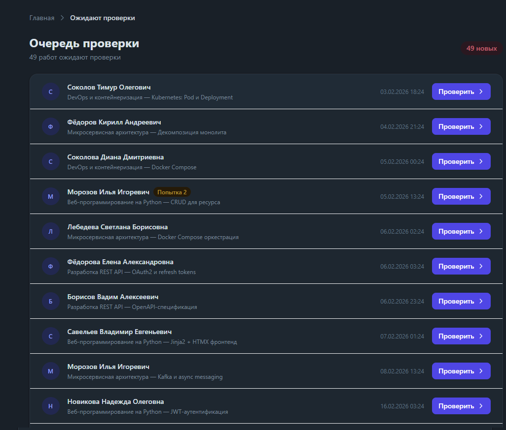

### 10.4 Экран проверки

Кнопка **«Проверить»** открывает экран проверки конкретной сдачи. Что на нём есть:

- **Данные студента** и метка «Просрочено», если сдано после дедлайна.
- **Ссылки** — все поля, которые заполнил студент.
- **Навигация по попыткам** (стрелки ← → и номера) — если попыток больше одной.
- **История попыток** — сворачиваемая лента со статусами всех попыток.
- **Комментарии** — общая переписка со студентом.

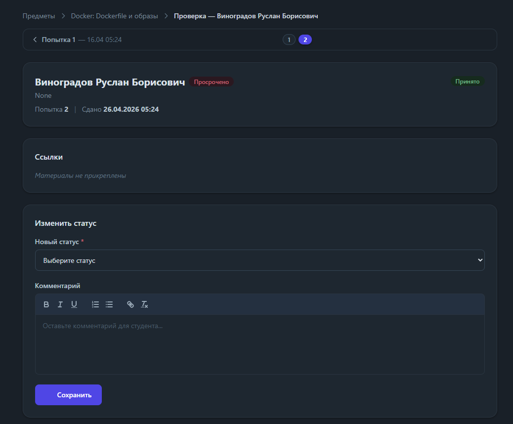

### 10.5 Статус и оценка — это разные кнопки

Ключевой момент:

- Блок **«Изменить статус»** — выпадающий список статусов + форматированный комментарий → кнопка **«Сохранить»**.
- Блок **«Оценка»** — поле «Баллы» (целое число) + короткий комментарий → **своя** кнопка **«Сохранить»**.

Это **две независимые кнопки**. Можно выставить баллы, не меняя статус (лабораторная работа останется «На проверке» с уже проставленными баллами), и наоборот. Сделано, чтобы можно было доставить баллы или поправить комментарий отдельно от смены статуса.

Каждое сохранение статуса и каждая ненулевая оценка отправляют студенту уведомление.

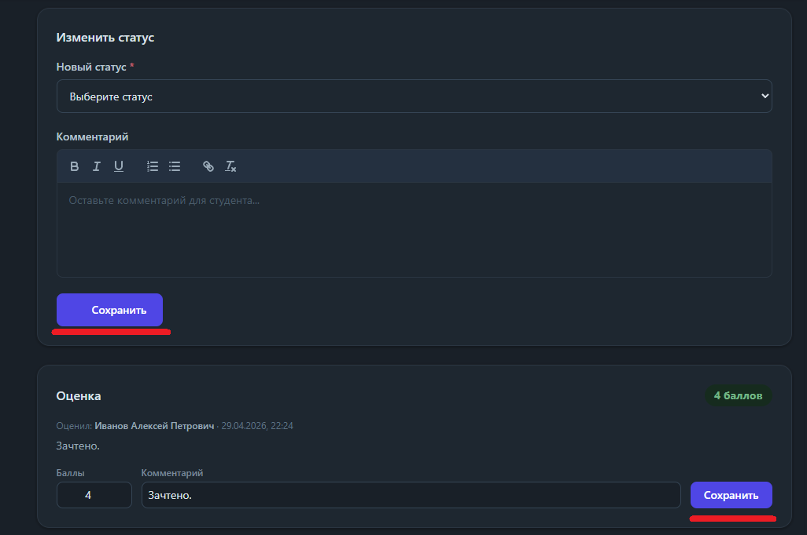

### 10.6 Блокировка оценки

Как только студент отправляет **следующую** попытку, оценка за предыдущую попытку **блокируется** — задним числом изменить её нельзя. Так сохраняется корректная история.

### 10.7 Вид лабораторной работы из потока

Если открыть лабораторную работу из потока кнопкой **«Открыть»**, сдачи сгруппированы по статусам в виде «аккордеона» (раскрыт раздел «На проверке»), и появляется кнопка «Копировать». Если открыть её вне контекста потока — плоский список всех сдач.

---

## 11. Консультации

### 11.1 Создание консультации

Со страницы предмета → **«Консультации»** → **«Добавить консультацию»**:

| Поле | Обязательное | Комментарий |
|---|---|---|
| **Дата и время** | да | Календарь. ⚠️ В тёмной теме поле календаря плохо видно — известная мелочь оформления. |
| **Место проведения** | да | Аудитория или ссылка на созвон (Толк и т. п.). |
| **Видимость (поток)** | нет | «Общая — для всех потоков» или конкретный поток. Выбирайте поток, если консультация только для него. |
| **Лимит записей на студента** | нет | Например, 1 — чтобы студент не приносил по 2–3 лабораторные работы за раз. |
| **Общий лимит мест** | нет | Например, 15 — максимум записей на консультацию. |
| **Примечания** | нет | Темы, особые условия. |

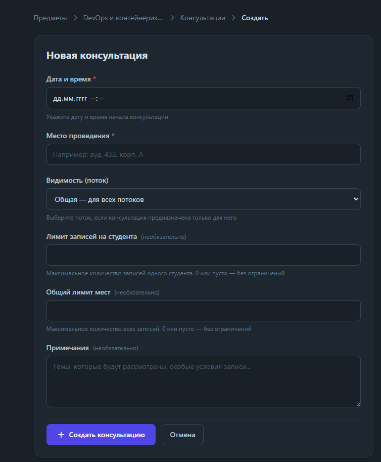

### 11.2 Типы записи и условия допуска (со стороны студента)

Студент при записи выбирает тип:

| Тип (как видит студент) | Когда доступен |
|---|---|
| **Сдача работы** | У студента есть приглашение на защиту, **или** есть сдача с заполненными ссылками на PR и документ. |
| **Другое** | Всегда, но нужно заполнить примечание. |

Внутри «Сдачи работы» студент может **прикрепить конкретную сдачу** из списка своих работ.

### 11.3 Ростер: приём студентов

На странице консультации преподаватель видит **ростер** — таблицу записавшихся, сгруппированную по типу («Работы», «Другое»). Ростер обновляется в реальном времени.

В каждой строке — выпадающий список статуса записи:

| Статус записи | Смысл |
|---|---|
| **В ожидании** | Студент записан, ещё не подошёл. |
| **Принимается** | Взяли в работу. |
| **Принят** | Приняли. |
| **Не пришёл** | Не явился. |
| **Отклонён** | Отклонили. |

Смена статуса записи отправляет студенту уведомление. У отменённых студентом записей виден статус «отмена» и причина.

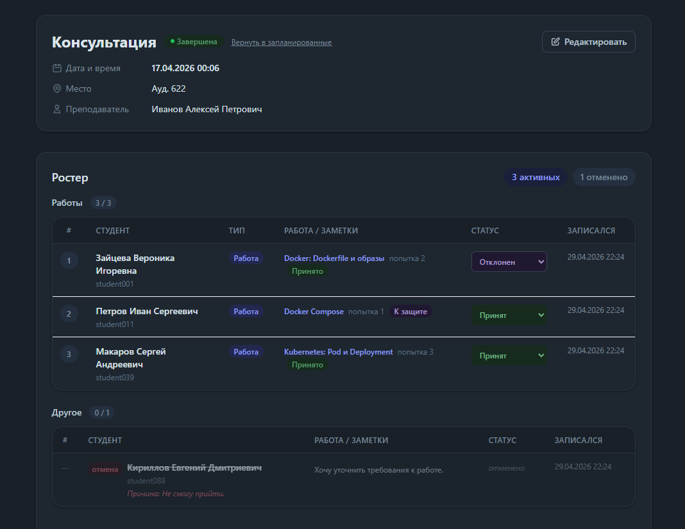

### 11.4 Статус записи ≠ статус лабораторной работы

Статус в ростере (**«Принят»**, **«Не пришёл»** …) — это **только про явку на консультацию**. Он **не** меняет статус лабораторной работы и не выставляет баллы. Чтобы оценить работу, зайдите в саму лабораторную работу / сдачу и там поставьте статус и баллы (см. [раздел 10.5](#105-статус-и-оценка--это-разные-кнопки)).

### 11.5 Завершение консультации

На странице консультации рядом со статусом:

- **«Отметить завершённой»** — переводит консультацию в «Завершена».
- **«Отменить»** — переводит в «Отменена».
- **«Вернуть в запланированные»** — возвращает завершённую/отменённую обратно.

Консультации **автоматически закрываются для записи** через сутки после времени начала. Все завершённые консультации собраны в сворачиваемом разделе **«Завершённые консультации»** в списке — туда можно зайти, чтобы посмотреть, что было раньше.

---

## 12. Аналитика: сводная таблица и экспорт

### 12.1 Сводная таблица потока

Кнопка **«Сводная таблица»** на странице потока (или в списке потоков на странице предмета). Это журнал потока: строки — студенты, столбцы — лабораторные работы, в каждой ячейке — статус последней попытки, число попыток и оценка.

- **Клик по ячейке** раскрывает под строкой студента панель с деталями последней сдачи и ссылкой **«Проверить →»**.
- Столбец активной лабораторной работы подсвечен.

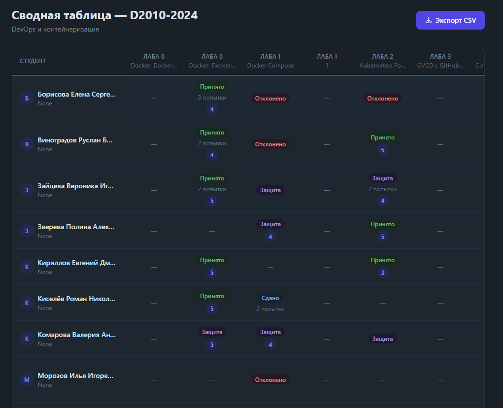

### 12.2 Экспорт CSV

Кнопка **«Экспорт CSV»** на странице потока и в сводной таблице — выгрузка успеваемости в файл. Реализация пока базовая; более подробный экспорт планируется.

### 12.3 Журнал студента

У студентов есть своя страница **«Журнал» / «Прогресс»** по потоку — однострочная матрица их собственных лабораторных работ со статусами и оценками. Преподавателю отдельно смотреть не нужно — вам достаточно сводной таблицы.

---

## 13. Уведомления

Колокольчик справа вверху, обновляется примерно раз в 30 секунд. Полный список — на странице **«Уведомления»** (`/notifications/`), прочитанные убираются кнопкой «Прочитано», клик по уведомлению ведёт на связанный экран.

Что порождает уведомления:

| Событие | Кому |
|---|---|
| Студент сдал работу | Владельцу предмета |
| Преподаватель изменил статус сдачи | Студенту |
| Преподаватель выставил оценку | Студенту |
| Преподаватель изменил статус записи на консультацию | Студенту |

---

## 14. Тёмная тема

Иконка луны/солнца справа вверху переключает светлую и тёмную темы. Выбор запоминается в браузере. По умолчанию тема следует настройке операционной системы.

Известная мелочь: в тёмной теме плохо виден встроенный календарь в поле «Дата и время» при создании консультации.

---

## 15. Частые вопросы и известные ограничения

**Не создаётся лабораторная работа.** Проверьте «Порядковый номер» — он должен быть **≥ 1**. Значение 0 не работает.

**Как удалить поток?** Никак — удаление потоков не поддерживается. Деактивируйте поток: он скроется от студентов и уедет в свёрнутый список.

**Как удалить предмет?** Через интерфейс — нельзя.

**Скопировал поток — где студенты?** Их нет и не должно быть: при копировании переносятся только лабораторные работы. Студентов запишите заново (паролем или вручную).

**Изменил схему полей — у старых сдач пропали ссылки.** Так и есть при переименовании/удалении полей. Не меняйте схему после начала сдач; добавлять новые поля можно.

**Студент не может записаться на консультацию «Сдача работы».** У него нет приглашения на защиту и нет сдачи с заполненными PR + документом. Либо переведите сдачу в «Приглашён на защиту», либо пусть выберет тип «Другое».

**Поставил статус в ростере — оценка не появилась.** Статус в ростере — только про явку. Баллы и статус лабораторной работы ставятся на экране проверки сдачи.

**Не могу изменить оценку за старую попытку.** Оценка блокируется, как только студент отправил следующую попытку.

**Поменял дедлайн — пересчитались ли просрочки?** Нет. «Просрочено» вычисляется в момент сдачи и не меняется задним числом.

**Роль пользователя.** Задаётся один раз, через интерфейс не меняется. Права преподавателя выдаёт администратор.

**Вход через университетскую учётную запись / восстановление пароля.** Пока не реализованы.

---

## Приложение. Полный сценарий «с нуля» за 10 шагов

1. **Зарегистрируйтесь и войдите.** Попросите администратора выдать права преподавателя.
2. **Создайте предмет** — «Создать предмет» на главной. Название, семестр, описание.
3. *(по желанию)* **Добавьте ассистентов** в блоке «Ассистенты» на странице предмета.
4. **Создайте поток-шаблон** — «Добавить поток». Задайте пароль (или оставьте пустым для ручной записи).
5. **Добавьте лабораторные работы** в поток — кнопка **«Добавить лабу»**. Номер ≥ 1, дедлайн по желанию, описание с заданием.
6. **Настройте поля для сдачи** у каждой лабораторной работы — блок «Поля для сдачи» внизу страницы редактирования → «Сохранить схему». Следующие лабораторные работы удобно делать кнопкой «Копировать».
7. *(по желанию)* **Задайте лимит попыток** у лабораторных работ.
8. **Деактивируйте поток-шаблон** и **скопируйте** его под каждую реальную группу («Копировать поток»).
9. **Запишите студентов**: сообщите пароль для самозаписи или добавьте вручную в блоке «Добавить студента».
10. **Работайте**: принимайте сдачи через «Очередь проверки», ставьте статус и баллы (разными кнопками), заводите консультации, следите за прогрессом в «Сводной таблице».

---

*Документ описывает текущую версию сервиса. Отдельные формулировки в интерфейсе могут отличаться.*
